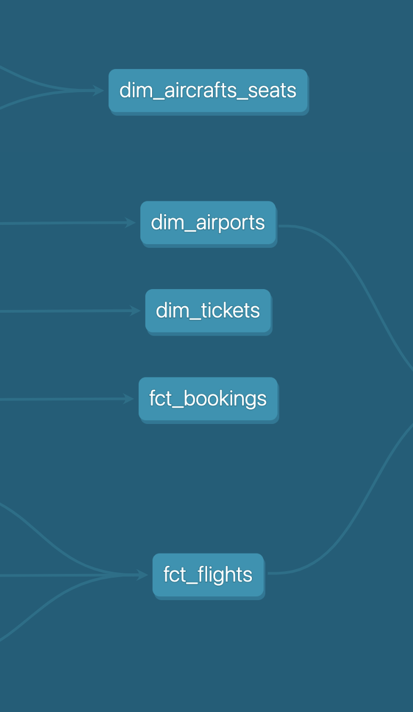

# Welcome to dbt Dimensional project using dbt!

This project will be in parts. You can always refer to the video for each part on the project.

[Part 1](#part-1)

[Part 2](#part-2)

### Part 1

Please use [this link](https://youtu.be/sweIeoNb4Mk?si=YFMzpdXrgwFvD9Y) to watch the video for part 1 and the following steps are covered in the part 1 of the video. 
- Install dbt-core on your system. Please refer to my video on [installing dbt](https://youtu.be/X1YvMReMVwk?si=GYo58V-mm9UgkfQQ)
- Install Postgres on your system or on docker. 
- Download [link to](https://postgrespro.com/docs/postgrespro/10/demodb-bookings-installation) the postgres database for this project.
- Restore database on your Postgres database. 
- Connect dbt to your Postgres.
- Data Cleaning and preparation
- Understand the database tables using the ERD.
- Please refer to the [video](https://www.youtube.com/watch?v=sweIeoNb4Mk)

 

### Business Context or Schema Description

_The main entity is a booking (bookings)._

_One booking can include several passengers, with a separate ticket (tickets) issued to each passenger. A ticket has a unique number and includes information about the passenger. As such, the passenger is not a separate entity. Both the passenger's name and identity document number can change over time, so it is impossible to uniquely identify all the tickets of a particular person; for simplicity, we can assume that all passengers are unique._

_The ticket includes one or more flight segments (ticket_flights). Several flight segments can be included into a single ticket if there are no non-stop flights between the points of departure and destination (connecting flights), or if it is a round-trip ticket. Although there is no constraint in the schema, it is assumed that all tickets in the booking have the same flight segments._

_Each flight (flights) goes from one airport (airports) to another. Flights with the same flight number have the same points of departure and destination, but differ in departure date.At flight check-in, the passenger is issued a boarding pass (boarding_passes), where the seat number is specified. The passenger can check in for the flight only if this flight is included into the ticket. The flight-seat combination must be unique to avoid issuing two boarding passes for the same seat._

_The number of seats (seats) in the aircraft and their distribution between different travel classes depends on the model of the aircraft (aircrafts) performing the flight. It is assumed that every aircraft model has only one cabin configuration. Database schema does not check that seat numbers in boarding passes have the corresponding seats in the aircraft (such verification can be done using table triggers, or at the application level)._

### Part 2 

Please refer to the [video[].

a. Identify fact and dimension tables.
